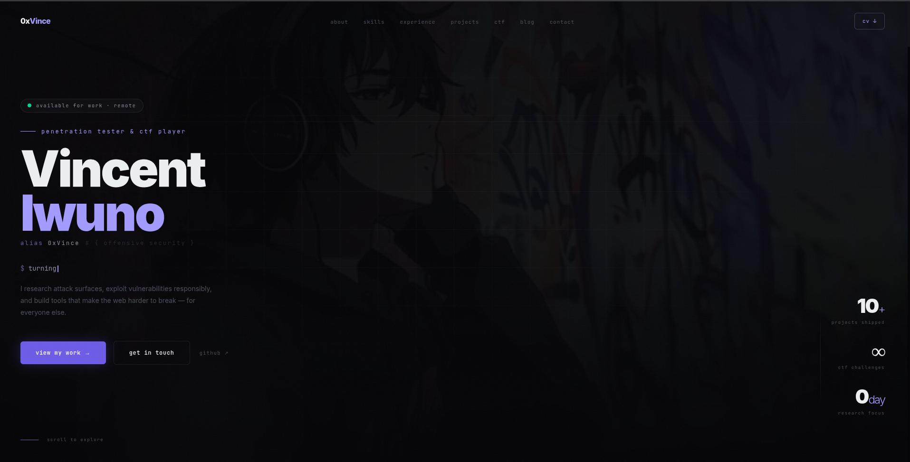

# 0xVince — Portfolio

> Personal cybersecurity portfolio built with Next.js 14, Framer Motion, and Tailwind CSS.




## Live Site
**[vincentiwuno.me](https://vincentiwuno.me)**

---

## Stack

| Layer | Tech |
|---|---|
| Framework | Next.js 14 (App Router) |
| Styling | Tailwind CSS |
| Animations | Framer Motion |
| Fonts | Inter + JetBrains Mono |
| Deployment | Vercel |
| Domain | Namecheap → vincentiwuno.me |

---

## Sections

- **Hero** — typing effect, glitch animation, parallax orbs
- **About** — avatar card with 3D tilt, social links, CV download
- **Skills** — mouse-tracked glow cards, 6 categories
- **Experience** — scroll-driven timeline, expandable entries
- **Projects** — status badges, impact callouts, WIP section
- **CTF** — platform cards, skill breakdown bars, writeup previews
- **Blog** — featured post, newsletter CTA
- **Contact** — form with send state, availability badge

---

## Features

- Custom loader with matrix rain + terminal boot sequence
- Konami code easter egg (`↑↑↓↓←→←→BA`)
- Background video with WebM/MP4 fallback
- Full SEO — OG image, JSON-LD schema, sitemap, robots.txt
- PWA manifest
- Responsive across all screen sizes

---

## Local Development

```bash
git clone https://github.com/vlex127/oxvince
cd portfolio
npm install
npm run dev
```

Open [localhost:3000](http://localhost:3000)

---

## Project Structure

```
app/
  page.tsx          # imports all sections
  layout.tsx        # metadata + fonts
  globals.css       # CSS variables + keyframes

components/
  Hero.tsx
  About.tsx
  Skills.tsx
  Experience.tsx
  Projects.tsx
  CTF.tsx
  Blog.tsx
  Contact.tsx
  Loader.tsx
  Navbar.tsx
  AnimatedSection.tsx
  KonamiEasterEgg.tsx

lib/
  data.ts           # all content data

public/
  og.png            # OG image 1200x630
  favicon.ico
  output.mp4        # hero background video
  profile.png       # avatar image
```

---

## Performance

- Video: WebM + MP4 with `faststart` flag, stripped audio
- Images: Next.js `<Image>` with `priority` + `quality={90}`
- Fonts: `display: swap` on all Google Fonts
- Cache: `max-age=31536000` on static assets via `next.config.ts`

---

## License

MIT — feel free to use as inspiration. Don't copy it wholesale.

---

*Built by [Vincent Iwuno](https://vincentiwuno.me) · [@0xvince](https://twitter.com/0xvince1)*